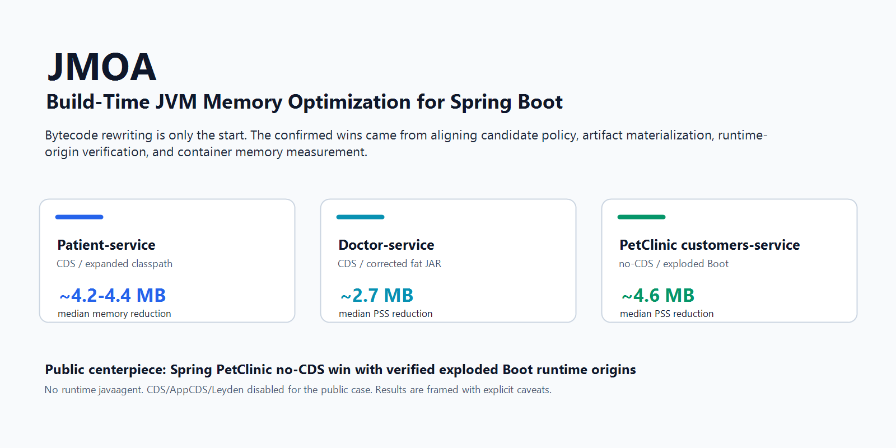
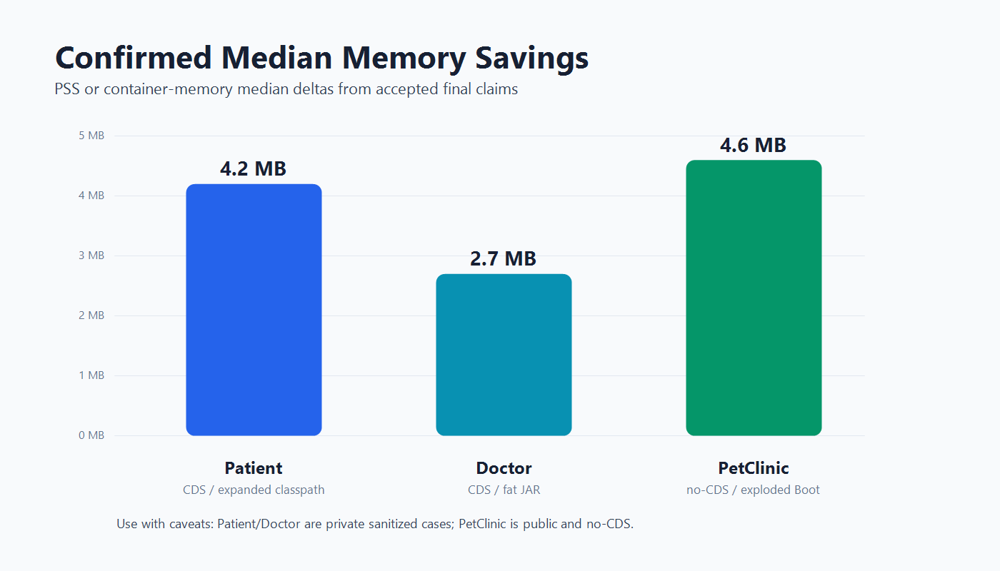
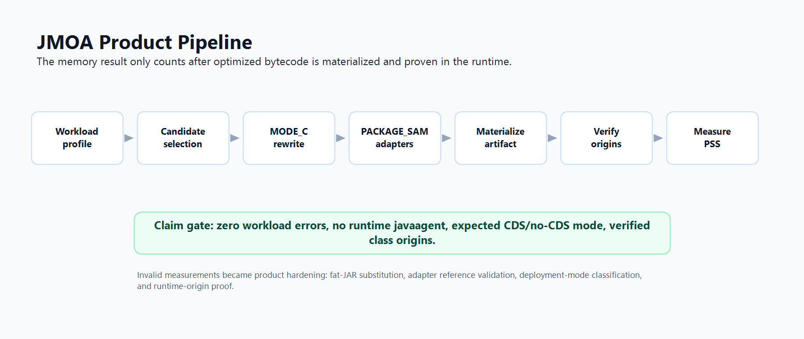
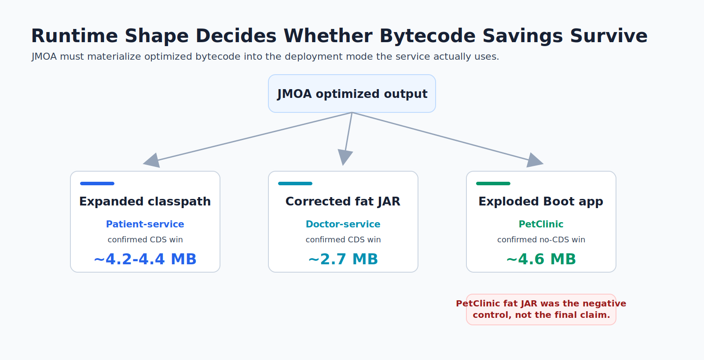

  

# JMOA JVM Optimization Portfolio

JMOA is a build-time JVM optimization project focused on reducing Spring Boot container memory by rewriting selected lambda and adapter patterns before runtime. The central finding is practical: JVM memory optimization is not only a bytecode problem. Artifact packaging, classloader visibility, CDS/no-CDS mode, runtime policy, and measurement discipline decide whether fewer classes become lower PSS and Private_Dirty.

This portfolio summarizes three confirmed case studies across different service shapes and deployment modes, with Spring PetClinic as the public no-CDS centerpiece.

## Confirmed Results

| Service | Source | Runtime mode | CDS? | Confirmed result | Status |
| --- | --- | --- | --- | --- | --- |
| Patient-service | private/internal | expanded classpath | yes | ~4.2-4.4 MB median memory reduction | confirmed |
| Doctor-service | private/internal | corrected Spring Boot fat JAR | yes | ~2.7 MB median PSS reduction | confirmed |
| Spring PetClinic `customers-service` | public OSS | exploded Boot / `JarLauncher` | no | ~4.6 MB median PSS reduction | confirmed |

  

The PetClinic result is deliberately phrased narrowly: it is a public open-source, non-CDS win under the project's real exploded Boot deployment shape with a low-dirty no-CDS runtime policy. The same candidate was not a final win under the artificial fat-JAR measurement shape.

## What JMOA Does

JMOA analyzes Java bytecode and workload profiles, identifies lambda and adapter patterns with favorable memory ROI, rewrites selected sites at build time, and materializes optimized artifacts for the target runtime shape.

The work here focuses on:

- MODE_C bytecode optimization
- PACKAGE_SAM adapter consolidation
- Spring Boot fat-JAR and exploded-Boot materialization
- Runtime-origin verification
- CDS and no-CDS measurement protocols
- Container memory measurement with PSS, Private_Dirty, cgroup `memory.current`, NMT, class histograms, and smaps

  

## Why Build-Time Instead Of Runtime Javaagent

Runtime javaagents are useful for diagnostics, but they complicate production memory claims. This portfolio uses build-time transformation so the measured process runs without a JMOA runtime javaagent.

That matters because the memory claim should belong to the optimized artifact and deployment shape, not to a live instrumentation layer.

## Case Studies

- [Spring PetClinic public no-CDS case study](CASE-STUDIES/01-petclinic-public-nocds-case-study.md)
- [Doctor-service fat-JAR/CDS hardening case study](CASE-STUDIES/02-doctor-service-fatjar-cds-hardening-case-study.md)
- [Patient-service confirmation addendum](CASE-STUDIES/03-patient-service-confirmation-addendum.md)
- [JMOA plugin and runtime hardening technical note](CASE-STUDIES/04-jmoa-plugin-runtime-hardening-technical-note.md)

## Key Engineering Lessons

1. Candidate selection is necessary but not sufficient.
2. Build success is not runtime success.
3. Spring Boot packaging mode can decide whether an optimization wins or loses.
4. Runtime-origin proof is a product requirement, not a nice-to-have.
5. PSS and Private_Dirty are more useful than RSS for JVM container memory claims.
6. CDS and no-CDS are different product modes with different economics.
7. Invalid measurements are valuable when they expose product invariants.

  

## Measurement Methodology

Primary memory metrics:

- smaps PSS
- smaps Private_Dirty
- cgroup `memory.current`

Supporting diagnostics:

- Native Memory Tracking
- `GC.class_histogram`
- `VM.metaspace`
- loaded class counts
- smaps region breakdown
- startup timing
- workload error counts
- dynamic class-load origin logs

The case studies distinguish measured facts from hypotheses. Invalid intermediate phases are documented as lessons but not cited as final wins.

## Diagram Policy

The README publishes rendered images because they are easier to scan on GitHub and in recruiter/reviewer contexts. Mermaid sources are kept beside the rendered assets under [ASSETS](ASSETS/) so the diagrams remain editable and auditable.

## Claim Integrity Rules

- Do not cite invalid Doctor Phase 32I as a final result.
- Do not cite the mistaken Doctor -5.9 MB median; the audited result is ~2.7 MB.
- Do not mix Patient Phase 31D-P2 official medians with Phase 31E independent evidence.
- Do not claim PetClinic wins under fat-JAR mode.
- Do not claim `MALLOC_ARENA_MAX=1` alone solved PetClinic no-CDS memory.
- Do not claim JMOA always wins.

## Skills Demonstrated

- JVM memory analysis
- Java bytecode transformation
- Spring Boot packaging internals
- AppCDS/CDS and no-CDS runtime measurement
- Container memory profiling
- `smaps`, PSS, Private_Dirty, cgroup, and NMT interpretation
- Runtime class-origin verification
- Experimental design and claim reconciliation
- Debugging invalid measurements into product hardening

## Evidence

Publish-safe summaries are under [EVIDENCE](EVIDENCE/). Raw local experiment outputs are intentionally not copied into this portfolio because they may contain local paths, bulky artifacts, or private environment details.
