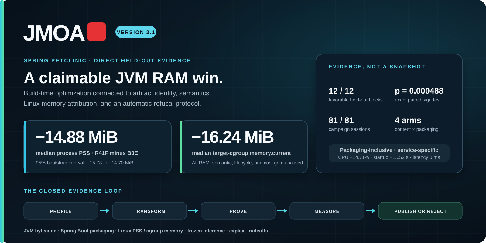
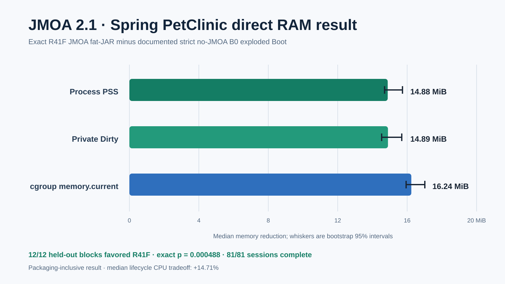

<p align="center">
  
</p>

# JMOA 2.1 JVM Optimization Portfolio

JMOA is an evidence-gated, build-time JVM footprint optimization system for
Spring Boot. It connects bytecode transformation to the deployment and
measurement layers required to prove that a service actually uses less RAM.

[Source](https://github.com/AlphaSudo/jmoa) ·
[JMOA 2.1 release](https://github.com/AlphaSudo/jmoa/releases/tag/v2.1.0) ·
[Technical paper](https://github.com/AlphaSudo/jmoa/blob/main/docs/paper/jmoa-v2.1-petclinic-memory-engineering.md) ·
[PetClinic evidence](EVIDENCE/v2.1/petclinic-direct-ram-win.md)

## Published PetClinic result

The exact accepted **R41F JMOA fat-JAR deployment** reduced Spring PetClinic
customers-service memory relative to the documented strict **no-JMOA B0
exploded-Boot deployment**:

| Metric | R41F - B0E | Held-out evidence |
| --- | ---: | --- |
| Process PSS | **-15,241.5 KiB (-14.88 MiB)** | 12/12 favorable; 95% CI [-16,109.5, -15,052.5] KiB |
| Target-cgroup `memory.current` | **-17,033,216 B (-16.24 MiB)** | 12/12 favorable; 95% CI [-17,842,176, -16,713,728] B |
| Private Dirty | **-15,252 KiB** | 12/12 favorable |
| Cgroup anonymous memory | **-15,616,000 B** | 12/12 favorable |
| Cgroup file memory | **-411,648 B** | 12/12 favorable |
| Exact paired sign test | **p = 0.00048828125** | Frozen primary inference |

<p align="center">
  
</p>

The campaign completed **81/81 sessions**: five qualifications, 20
same-artifact controls, eight direct-screen observations, and 48 held-out
four-arm observations. No predecessor observation was reused. Every frozen RAM,
semantic, lifecycle, and product-cost gate passed.

The tradeoff is public: median lifecycle CPU increased **14.71%** and startup
increased **1.652 seconds**. Median and p95 request latency changes were both
0 ms.

This is a **packaging-inclusive, service-specific result**. The factorial
estimated a -12,715.25 KiB packaging main effect, -2,465 KiB content main
effect, and +3,801.5 KiB interaction. It would be incorrect to attribute the
entire 14.88 MiB to metadata reduction alone.

## What JMOA solves

JVM optimization projects commonly break at the boundaries between tools:

- profiles drift from the bytecode being transformed;
- unsafe or framework-owned sites enter a transformation set;
- optimized dependencies are not materialized into the final Boot artifact;
- the JVM loads a stale or unintended class origin;
- smaller artifacts fail to reduce live memory;
- a single favorable run is mistaken for a stable result;
- CPU or startup regressions are omitted from the memory story.

JMOA addresses that entire chain:

```text
workload profile
      → conservative admission
      → build-time rewriting / audited metadata reduction
      → classfile byte-preservation proof
      → Spring Boot deployment materialization
      → artifact and runtime-origin proof
      → semantic workload
      → paired PSS + cgroup confirmation
      → scoped claim or automatic rejection
```

## Engineering depth

The project exercises several layers of systems engineering:

| Area | Work demonstrated |
| --- | --- |
| JVM bytecode | ASM-based lambda-site analysis, adapter generation, classfile component hashing, conservative exclusions |
| Build tooling | Maven plugin goals, profile/coverage contracts, reproducible release artifacts |
| Spring Boot packaging | Fat-JAR and exploded-Boot materialization, nested dependency replacement, launch-shape proof |
| Linux memory | `smaps`, PSS, Private Dirty, cgroup v2, page faults, swap/reclaim checks, mapping attribution |
| JVM diagnostics | NMT, heap/metaspace/code cache, class counts, JIT/GC lifecycle evidence |
| Experiment design | Same-artifact controls, balanced orders, held-out blocks, frozen gates, exact tests, bootstrap intervals |
| Reliability | Failure-preserving ledgers, process identity, teardown checks, atomic evidence publication |
| Communication | Human claims, machine-readable evidence, explicit limitations and adverse tradeoffs |

## Why build-time instead of a production javaagent

The profiler is used during training. Accepted services are transformed before
deployment and run without a JMOA optimization javaagent. This keeps the final
memory claim attached to the exact artifact and launch shape, rather than to a
live instrumentation layer that also consumes memory and changes timing.

## Safety model

- Mutation is opt-in; discovery defaults to report-only.
- Capturing, serializable, `altMetafactory`, unsupported, and risky framework
  sites remain unchanged.
- Signed, sealed, and multi-release dependency JARs are skipped by the raw
  reducer.
- Non-target classfile structures must remain byte-equivalent.
- Intended replacements and runtime origins are hash-bound.
- Health, workload, linkage, verifier, swap, capture, and teardown failures
  stop the campaign.
- Valid losing runs are retained; gates are not relaxed after result exposure.

## Current public scope

JMOA 2.1 publishes PetClinic as its current direct service example. Additional
service examples will follow only after independent, service-scoped
confirmation. Older Doctor and Patient research remains available in this
portfolio as engineering history; it is not folded into the PetClinic effect
size and is not advertised as part of the v2.1 claim.

Detailed records:

- [PetClinic 2.1 direct RAM case study](CASE-STUDIES/05-petclinic-v21-direct-ram-win.md)
- [Machine-readable PetClinic summary](EVIDENCE/v2.1/petclinic-direct-ram-win.json)
- [Earlier PetClinic no-CDS case study](CASE-STUDIES/01-petclinic-public-nocds-case-study.md)
- [JMOA plugin/runtime hardening note](CASE-STUDIES/04-jmoa-plugin-runtime-hardening-technical-note.md)
- [Historical evidence inventory](publish-evidence-inventory.md)

## Source and release

The public source lives at [AlphaSudo/jmoa](https://github.com/AlphaSudo/jmoa).
JMOA 2.1 ships the Maven plugin, Java 17-compatible runtime library, source
JARs, POMs, manifest, and SHA-256 checksums through GitHub Releases.

The source and portfolio are intentionally separate. The source repository is
the code, architecture, safety, and reproducibility surface. This repository is
the evidence and engineering narrative.

## About the work

This portfolio is aimed at JVM, Java platform, performance, and systems
engineering roles. It demonstrates ownership from bytecode and build tooling
through Linux observability, experiment design, root-cause investigation,
release engineering, and public technical writing.

If that is the kind of engineering problem your team works on, reach out
through the [AlphaSudo GitHub profile](https://github.com/AlphaSudo).
