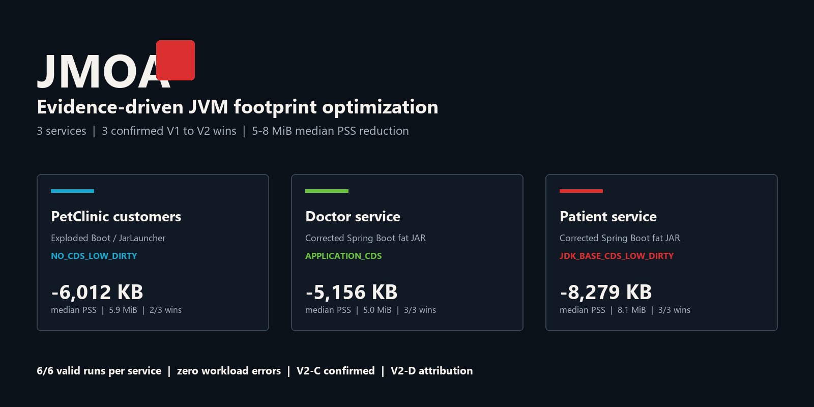
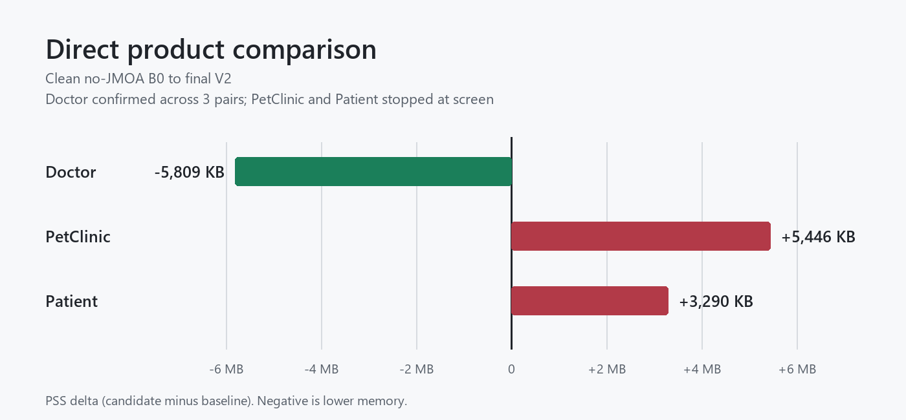
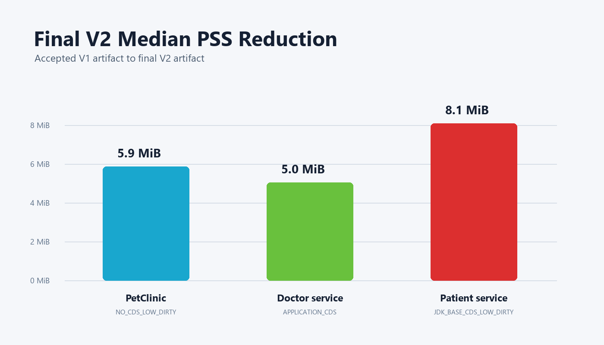
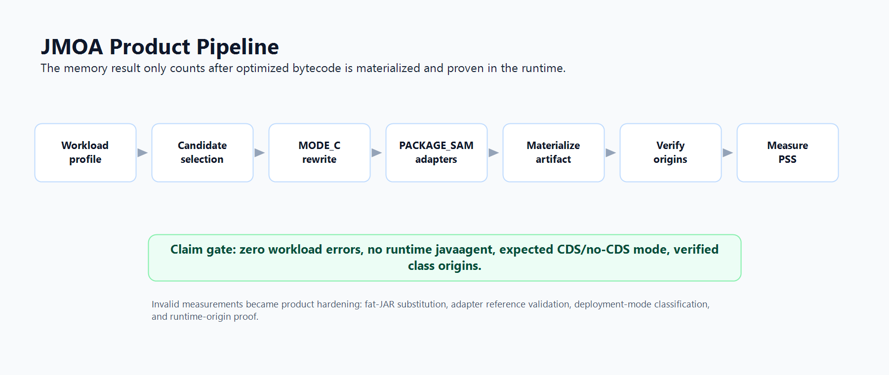
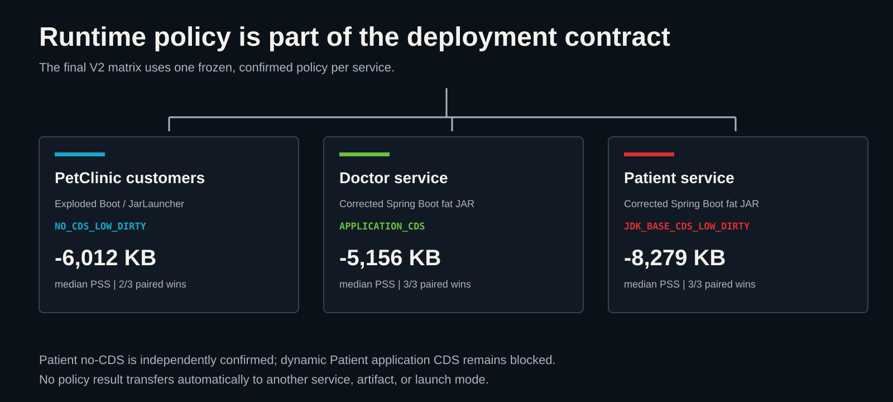

  

# JMOA V2 JVM Optimization Portfolio

JMOA is an evidence-driven, build-time JVM footprint optimization system for Spring Boot. It combines admitted lambda/adapter rewriting, raw dependency metadata reduction, byte-preservation auditing, deployment materialization, runtime-origin proof, paired evidence validation, and memory attribution.

This portfolio presents both the direct no-JMOA product result and the separate V1-to-V2 engineering-evolution result across three service shapes. Spring PetClinic remains the public reproduction bridge; Doctor is the only service that cleared the final direct substantial-win gate.

## Source Code

The public JMOA source release lives in a separate repository:

- [AlphaSudo/jmoa](https://github.com/AlphaSudo/jmoa) contains the Maven plugin, runtime library, materialization and origin-proof tooling, evidence/attribution engines, and the clean-clone-qualified PetClinic build and semantic-smoke workflow.

This repository remains the evidence and case-study portfolio. The source repo is intentionally separate so private HMS evidence can stay sanitized while the public tooling has its own clean build surface.

## Direct Product Verdict

The buyer-facing comparison is clean no-JMOA `B0` versus final JMOA V2.

| Service | Frozen protocol | Direct result | Verdict |
| --- | --- | ---: | --- |
| **Doctor service** | Fat JAR, artifact-specific application CDS | **-5,809 KB median PSS**, 3/3 wins | Confirmed substantial win |
| **PetClinic customers** | Exploded Boot, `NO_CDS_LOW_DIRTY` | +5,446 KB PSS | Screen failed |
| **Patient service** | Fat JAR, stock JDK base CDS | +3,290 KB PSS on corrected screen | Screen failed |

Overall state: `ONE_SERVICE_PRODUCT_WIN`. This proves a material direct result
on one service, not a universal memory win. The two losing screens are retained
because evidence-gated rejection is part of the product.

  

[Read the direct matrix](EVIDENCE/v2-final/direct-product-matrix.md) or inspect
the [machine-readable record](EVIDENCE/v2-final/direct-product-matrix.json).

## V1 To V2 Engineering Evolution

| Public reproducibility | Private fat-JAR/CDS | Runtime-policy selection |
| --- | --- | --- |
| **PetClinic customers** Exploded Boot, `NO_CDS_LOW_DIRTY` V1 to V2: **-6,012 KB median PSS**, 2/3 wins [Case study](CASE-STUDIES/01-petclinic-public-nocds-case-study.md) | **Doctor service** Corrected fat JAR, `APPLICATION_CDS` D2 to D2R: **-5,156 KB median PSS**, 3/3 wins [Case study](CASE-STUDIES/02-doctor-service-fatjar-cds-hardening-case-study.md) | **Patient service** Corrected fat JAR, `JDK_BASE_CDS_LOW_DIRTY` V1 to V2: **-8,279 KB median PSS**, 3/3 wins [Case study](CASE-STUDIES/03-patient-service-confirmation-addendum.md) |

All three evolution comparisons have 6/6 valid runs, zero workload errors, V2-C `CONFIRMED_WIN`, and V2-D attribution. They show how V2 improved accepted V1 artifacts; they are not added to earlier baseline-to-V1 medians. Patient no-CDS is also independently confirmed at -8,903 KB median PSS. Dynamic Patient application CDS remains rejected for the tested single-replica deployment.

These are protocol-specific results. They do not establish universal benefit from CDS, no-CDS, a packaging shape, or one allocator policy.

  

[Open the one-page V1-to-V2 summary](ASSETS/portfolio-summary.pdf) or inspect the
[machine-readable evolution matrix](EVIDENCE/v2-final/three-service-matrix.json).

## What JMOA Does

JMOA analyzes Java bytecode and workload profiles, identifies lambda and adapter patterns with favorable memory ROI, rewrites selected sites at build time, and materializes optimized artifacts for the target runtime shape.

V2 covers:

- MODE_C bytecode optimization
- PACKAGE_SAM adapter consolidation
- raw dependency LVT/LVTT metadata reduction
- normalized non-target byte-preservation auditing
- Spring Boot fat-JAR and exploded-Boot materialization
- Runtime-origin verification
- service-specific no-CDS, stock base-CDS, and application-CDS protocols
- paired evidence validation and memory attribution
- Container memory measurement with PSS, Private_Dirty, cgroup `memory.current`, NMT, class histograms, and smaps

  

## Why Build-Time Instead Of Runtime Javaagent

Runtime javaagents are useful for diagnostics, but they complicate production memory claims. This portfolio uses build-time transformation so the measured process runs without a JMOA runtime javaagent.

That matters because the memory claim should belong to the optimized artifact and deployment shape, not to a live instrumentation layer.

## Detailed Records

- [Spring PetClinic public no-CDS case study](CASE-STUDIES/01-petclinic-public-nocds-case-study.md)
- [Doctor-service fat-JAR/CDS hardening case study](CASE-STUDIES/02-doctor-service-fatjar-cds-hardening-case-study.md)
- [Patient-service confirmation addendum](CASE-STUDIES/03-patient-service-confirmation-addendum.md)
- [JMOA plugin and runtime hardening technical note](CASE-STUDIES/04-jmoa-plugin-runtime-hardening-technical-note.md)

## Key Engineering Lessons

1. Candidate selection is necessary but not sufficient.
2. Build success is not runtime success.
3. Spring Boot packaging mode can decide whether an optimization wins or loses.
4. Runtime-origin proof is a product requirement, not a nice-to-have.
5. PSS and Private_Dirty are more useful than RSS for JVM container memory claims.
6. CDS and no-CDS are different product modes with different economics.
7. Invalid measurements are valuable when they expose product invariants.

  

## Measurement Methodology

Primary memory metrics:

- smaps PSS
- smaps Private_Dirty
- cgroup `memory.current`

Supporting diagnostics:

- Native Memory Tracking
- `GC.class_histogram`
- `VM.metaspace`
- loaded class counts
- smaps region breakdown
- startup timing
- workload error counts
- dynamic class-load origin logs

The case studies distinguish measured facts from hypotheses. Invalid intermediate phases are documented as lessons but not cited as final wins.

## Diagram Policy

The README publishes rendered images because they are easier to scan on GitHub and in recruiter/reviewer contexts. Mermaid sources are kept beside the rendered assets under [ASSETS](ASSETS/) so the diagrams remain editable and auditable.

## Claim Integrity Rules

- Lead adoption claims with the clean no-JMOA direct matrix: one confirmed
  Doctor win, with PetClinic and Patient screen failures.
- Keep the successful three-service V1-to-V2 matrix labeled as engineering
  evolution; never add its medians to older baseline-to-V1 results.
- Do not cite invalid Doctor Phase 32I or old portfolio medians as V2 results.
- Use Doctor D2-to-D2R `-5,156 KB`, not the superseded V1-era `~2.7 MB` figure.
- Use Patient stock-base-CDS `-8,279 KB` for the primary final matrix; keep its independent no-CDS result separate.
- Do not describe Patient stock base CDS as Patient application CDS.
- Do not transfer PetClinic's exploded-Boot result to fat-JAR mode.
- Do not claim `MALLOC_ARENA_MAX=1` alone solved PetClinic no-CDS memory.
- Do not claim JMOA always wins.

## Skills Demonstrated

- JVM memory analysis
- Java bytecode transformation
- Spring Boot packaging internals
- AppCDS/CDS and no-CDS runtime measurement
- Container memory profiling
- `smaps`, PSS, Private_Dirty, cgroup, and NMT interpretation
- Runtime class-origin verification
- Experimental design and claim reconciliation
- Debugging invalid measurements into product hardening

## Evidence

The [direct product matrix](EVIDENCE/v2-final/direct-product-matrix.md) is the current adoption claim source. The [V1-to-V2 matrix](EVIDENCE/v2-final/three-service-matrix.md) is the engineering-evolution source. Earlier Phase 31-33 summaries are retained under [EVIDENCE](EVIDENCE/) as explicitly historical records. Raw local experiment outputs are intentionally excluded because they may contain local paths, bulky artifacts, or private environment details.
